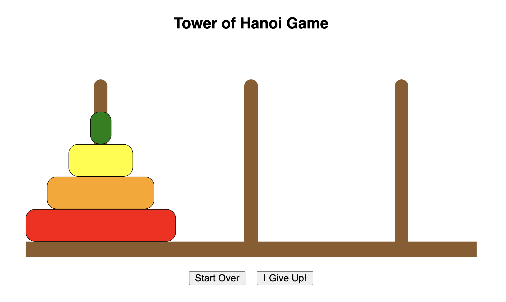

This is my version of the classic 'Tower of Hanoi' game, implemented with JavaScript

Access the game [here](esaltzm.github.io/tower-of-hanoi)

Here were some of the user stories I used as a guide while creating the game:

    * AAU, I want to be greeted with a landing page that explains how to play the game before I continue on to play
    * AAU, I want to be provided feedback when I am attempting to make a possible move or whether it is against the rules of the game
    * AAU, I want to be able to click on a ring, then click on another rod to place it there // Potential to add drag and drop functionality to improve UI //
    * AAU, I want to be able to select different levels of difficulty for the game
    * AAU, I want some kind of celebratory signal to notify my when I have won the game
    * AAU, I want to be scored based on how quickly I won the game, and how few moves I have used to win

Some of the struggles I overcame during this project:

    * Animating a ring drop as it was placed on a rod — I knew that I wanted the rings to be draggable
    and droppable to better mimic the user experience of the tangible version of this game. While tough to
    implement, the route I chose to make these drop animations happen was to create a custom CSS rule each
    time a user dropped a ring, including a transition based on the location where the ring was dropped, and
    where it was meant to end up on the rod.
    * Enabling an auto-solve button — As soon as I knew I wanted to include multiple levels of the game, I
    knew I would need to give the user a way to get to the next level when they couldn't solve the puzzle
    alone. Personally, I could only solve up to n = 4 rings. To do this, I wanted to show the user the
    optimal path the rings would take by using the Tower of Hanoi algorithm, and implementing a delay between
    the movements of each ring so the user could understand how the algorithm functions. 