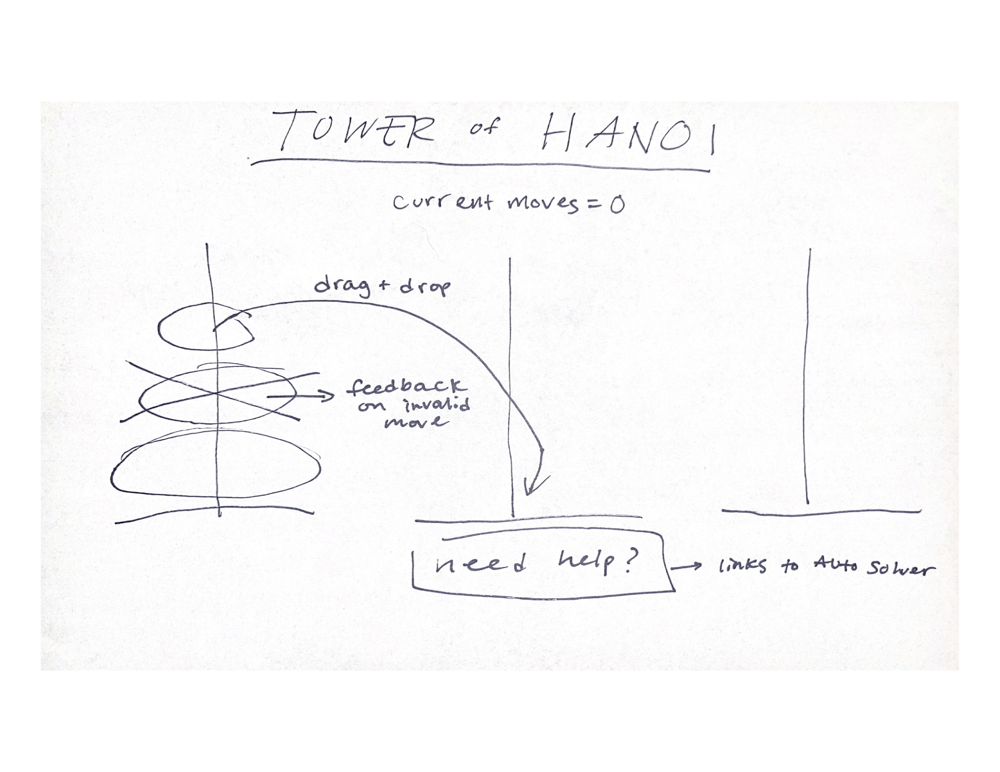

This is my version of the classic 'Tower of Hanoi' game, implemented with HTML, CSS, and JavaScript

Access the game <a href="esaltzm.github.io/tower-of-hanoi">here</a>

Here were some of the user stories I used as a guide during the project, assuming that they are not familiar with this game:

<ul>
    <li>As a user, I want to be greeted with a landing page that explains how to play the game before I continue on to play.</li>
    <li>AAU, I want to be provided feedback when I am attempting to make a possible move or whether it is against the rules of the game.</li>
    <li>AAU, I want to be able to drag and drop rings as though I was picking them up and placing them down physically.</li>
    <li>AAU, I want to be able to select different levels of difficulty for the game.</li>
    <li>AAU, I want some kind of celebratory signal to notify my when I have won the game</li>
<ul>

My wireframe prior to development:

Some of the struggles I overcame during this project included:

<ul>
    <li>Animating a ring drop as it was placed on a rod — I knew that I wanted the rings to be draggable and droppable to better mimic the user experience of the tangible version of this game. While tough to implement, the route I chose to make these drop animations happen was to create a custom CSS rule each time a user dropped a ring, including a transition based on the location where the ring was dropped, and where it was meant to end up on the rod.</li>
    <li>Enabling an auto-solve button — As soon as I knew I wanted to include multiple levels of the game, I knew I would need to give the user a way to get to the next level when they couldn't solve the puzzle alone. Personally, I could only solve up to n = 4 rings. To do this, I wanted to show the user the optimal path the rings would take by using the Tower of Hanoi algorithm, and implementing a delay between the movements of each ring so the user could understand how the algorithm functions. </li>
</ul>